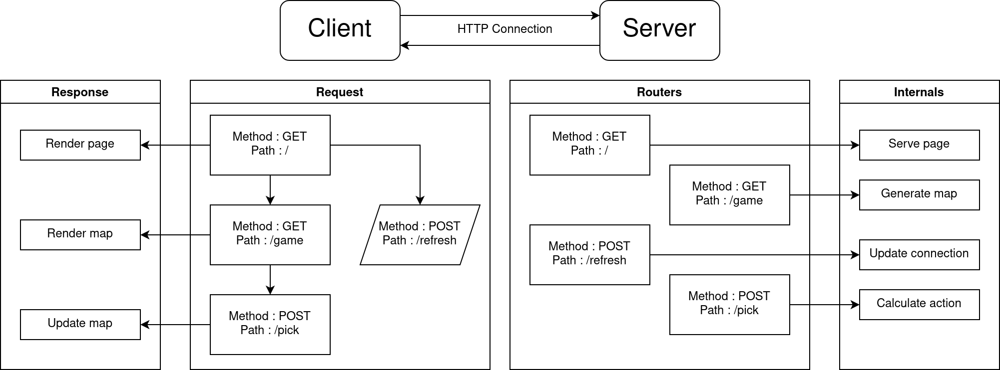

### Lattleship : battleship made with lua

Lattleship is a Lua server oriented battleship game with javascript frontend.
Client handles server response and update graphical map accordingly. Every game
action and calculations are executed in server side.

Lattleship has responsive css styles so it can cope with various screen forms.

Lattleship server is implemented as stateful which saves client's game state as
local variables with timeout mechanisms.

[Repit source](https://replit.com/@Simhyeon/lattleship)

[Hosted url](https://lattleship.simhyeon.repl.co)

**Specification**

Server
- [Luvit](https://github.com/luvit/luvit) ( NodeJS-like Lua runtime )
- [Weblit](https://github.com/creationix/weblit) ( ExpressJS like web framework )
- Repl.it serverless platform

Client
- Bundled with [R4d](https://github.com/simhyeon/r4d)
- Vanila Javascript

### Basic workflow

### Demo Image

